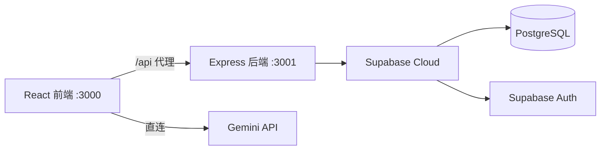

# 乡土印迹 - 前后端一体化 Web 应用需求规格文档 (PRD)

## 1. 项目概述

**项目名称**: 乡土印迹 (Rural Imprint)
**目标**: 将纯前端展示应用改造为前后端一体化的全栈 Web 应用，使用 Supabase 作为数据持久层。

## 2. 技术架构

| 层 | 技术 |
|---|---|
| 前端 | React 19 + Vite 6 + TailwindCSS 4 + Framer Motion |
| 后端 | Express 4 + TypeScript (tsx 运行) |
| 数据库 | Supabase (PostgreSQL + Auth) |
| AI | Google Gemini API (ChatWidget) |



## 3. 数据库 Schema (12 张表)

| 表名 | 用途 | 关键字段 |
|---|---|---|
| profiles | 用户扩展信息 | user_id (FK→auth.users), role, display_name |
| dashboard_stats | 首页统计 | icon, label, value, change_percent |
| products | 产品 | name, grade, origin, sugar_degree, weight_g |
| product_trace_steps | 产品溯源步骤 | product_id (FK), title, step_time, is_active |
| traceability_batches | 溯源批次 | batch_code, product_id (FK), status, total_nodes |
| traceability_steps | 批次生命周期步骤 | batch_id (FK), step_name, icon, is_current |
| traceability_nodes | 节点监控 | name, latency, load, status |
| gis_overview | GIS 概览 | total_production, verification_rate |
| gis_zones | 农业分区 | name, color, area_value |
| alerts | 预警 | title, description, severity |
| production_lines | 产线 | name, status, efficiency, progress |
| production_logs | 生产日志 | log_time, message, log_type |
| harvest_logs | 采摘动态 | user_name, action, amount, location |

## 4. API 端点设计

### 4.1 认证 (`/api/auth`)
- `POST /login` — 用户登录
- `POST /register` — 用户注册
- `GET /me` — 获取当前用户信息

### 4.2 业务数据
- `GET /api/dashboard/stats` — 首页统计
- `GET /api/products` / `GET /api/products/:id` — 产品
- `GET /api/traceability/stats` / `/batches` / `/batches/:id` / `/nodes` — 溯源
- `GET /api/gis/overview` / `/zones` / `/alerts` — GIS
- `GET /api/capacity/lines` / `/logs` / `POST /circuit-break` — 产能
- `GET /api/harvest/logs` — 采摘动态

### 4.3 管理后台
- `GET /api/admin/users` — 获取所有注册用户信息
- `GET /api/admin/traces` — 获取所有溯源上链记录

## 5. 部署指南

### 前置条件
1. 安装 [Node.js](https://nodejs.org/) (>=18)
2. 创建 [Supabase](https://supabase.com/) 项目

### 步骤
```bash
npm install

# 在 Supabase SQL Editor 中执行
# supabase/schema.sql (建表)
# supabase/seed.sql (导入种子数据)

# 在 .env 文件中填入真实密钥
# SUPABASE_URL=https://xxx.supabase.co
# SUPABASE_ANON_KEY=eyJ...
# SUPABASE_SERVICE_ROLE_KEY=eyJ...

# 启动（Windows 需分别启动两个终端）
# 终端1: npm run server
# 终端2: npm run dev

# 访问 http://localhost:3000
```
